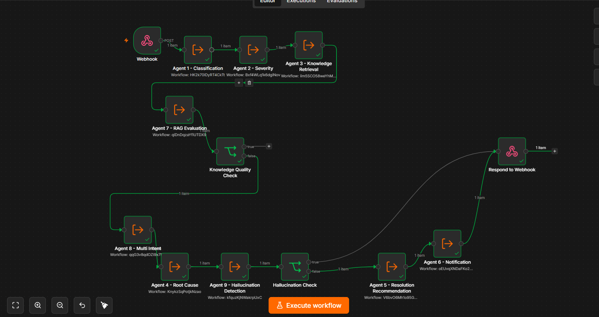

<div align="center">

# 🚀 Enterprise AI Incident Resolution System

### Intelligent Multi-Agent AI Platform for Enterprise IT Incident Management

<p align="center">


</p>

An **AI-powered Enterprise Incident Resolution System** that automates incident analysis using **Google Gemini, Pinecone RAG, n8n Workflow Automation, Docker, and AWS EC2**.

---
## 🎥 Project Demonstration

A complete demonstration of the Enterprise AI Incident Resolution System, including incident submission, Multi-Agent AI processing, Pinecone retrieval, Trello integration, and API response, is available on LinkedIn.

🔗 Watch the demo:
https://www.linkedin.com/posts/YOUR_POST_LINK

---

## 📖 Overview

Traditional enterprise incident management requires engineers to manually analyze logs, search documentation, identify root causes, and notify responsible teams.

This project automates the complete incident resolution lifecycle using a **Multi-Agent AI architecture**.

Instead of relying on a single AI prompt, multiple AI agents collaborate to:

- Classify incidents
- Assess severity
- Retrieve enterprise knowledge
- Identify root causes
- Validate AI responses
- Recommend resolutions
- Create Trello incident tickets
- Return structured API responses

---

## ✨ Features

| Feature | Status |
|---------|--------|
| 🤖 Multi-Agent AI | ✅ |
| 🧠 Google Gemini | ✅ |
| 📚 Pinecone RAG | ✅ |
| 🔍 Semantic Search | ✅ |
| 🧩 Root Cause Analysis | ✅ |
| 🛡 Hallucination Detection | ✅ |
| 📢 Notification Generation | ✅ |
| 📋 Trello Integration | ✅ |
| ⚙️ n8n Automation | ✅ |
| 🐳 Docker Deployment | ✅ |
| ☁️ AWS EC2 Deployment | ✅ |
| 🌐 REST API | ✅ |

---

# 🏗 System Architecture

```text
                 Client
                    │
                    ▼
             REST Webhook API
                    │
                    ▼
      Enterprise AI Orchestrator (n8n)
                    │
 ┌────────────────────────────────────┐
 │ Agent 1  Incident Classification   │
 │ Agent 2  Severity Assessment       │
 │ Agent 3  Knowledge Retrieval (RAG) │
 │ Agent 7  Knowledge Evaluation      │
 │ Agent 8  Multi Intent Detection    │
 │ Agent 4  Root Cause Analysis       │
 │ Agent 9  Hallucination Detection   │
 │ Agent 5  Resolution Recommendation │
 │ Agent 6  Notification Generation   │
 └────────────────────────────────────┘
                    │
                    ▼
        Automatic Trello Ticket
                    │
                    ▼
            JSON API Response
```

---

# ⚙️ Technology Stack

| Layer | Technology |
|--------|------------|
| 🤖 AI Model | Google Gemini 2.5 Flash Lite |
| 🧠 AI Architecture | Multi-Agent AI |
| 📚 Vector Database | Pinecone |
| 🔍 Retrieval | Retrieval-Augmented Generation (RAG) |
| ⚙️ Workflow Automation | n8n |
| 🐳 Runtime | Docker |
| ☁️ Deployment | AWS EC2 |
| 🌐 API | REST Webhook |
| 💻 Language | JavaScript |
| 📄 Knowledge Base | Markdown Documents |

---

# 🔄 Workflow

```text
Incident
      │
      ▼
Classification
      │
      ▼
Severity Assessment
      │
      ▼
Knowledge Retrieval
      │
      ▼
Knowledge Evaluation
      │
      ▼
Root Cause Analysis
      │
      ▼
Hallucination Detection
      │
      ▼
Resolution Recommendation
      │
      ▼
Notification Generation
      │
      ▼
Create Trello Card
      │
      ▼
JSON Response
```

---

# 📂 Repository Structure

```text
Enterprise-AI-Incident-Resolution-System
│
├── workflows/
├── knowledge-base/
├── documentation/
├── screenshots/
├── .env.example
├── docker-compose.yml
├── README.md
└── LICENSE
```

---

# 🚀 Installation

```bash
git clone https://github.com/dasu07988/Enterprise-AI-Incident-Resolution-System.git

cd Enterprise-AI-Incident-Resolution-System

docker compose up -d
```

Open

```
http://localhost:5678
```

Import all workflows and configure:

- Google Gemini
- Pinecone
- Trello

---

# 📡 REST API

### Endpoint

```http
POST /webhook/enterprise-ai-orchestrator
```

### Request

```json
{
  "incident_id":"INC-1001",
  "title":"Payment API Down",
  "description":"Customers receive HTTP 500 errors.",
  "service":"Payment Gateway"
}
```

### Response

```json
{
 "classification":"Payment System",
 "severity":"Critical",
 "root_cause":"Database connection pool exhausted",
 "recommended_resolution":"Restart payment service.",
 "priority":"Critical"
}
```

---

# 📸 Screenshots

## Workflow



---

## Pinecone


---

## Trello


---

## API Response


---

# 📊 Project Status

| Module | Status |
|---------|--------|
| Multi-Agent AI | ✅ Complete |
| Google Gemini | ✅ Complete |
| Pinecone | ✅ Complete |
| RAG | ✅ Complete |
| n8n | ✅ Complete |
| Docker | ✅ Complete |
| AWS EC2 | ✅ Complete |
| REST API | ✅ Complete |
| Trello Integration | ✅ Complete |

---

# 🚀 Future Improvements

- 📊 React Dashboard
- 📈 Incident Analytics
- 💬 Slack Integration
- 📧 Email Notifications
- 📝 Jira Integration
- ☸ Kubernetes Deployment

---

# 👩‍💻 Author

**Dasuni Jayasundara**

Information Technology Undergraduate

**GitHub**

https://github.com/dasu07988

**LinkedIn**
www.linkedin.com/in/dasuni-jayasundara-46a602209

---

# ⭐ Support

If you found this project useful, please consider giving it a ⭐.

---

# 📄 License

Licensed under the MIT License.

---

<div align="center">

Built with ❤️ using

**Google Gemini • Pinecone • n8n • Docker • AWS**

</div>